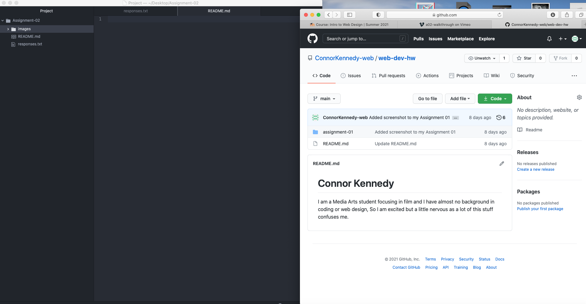

# Assignment-02
## Connor Kennedy

  I took this class to have a better understanding of how the internet works and how to create with it.  I am a film major so this kind of class is not particularly in my field but it does interest me.  When It comes to computers I am not as fluent as I would like to be and I believe this class will help!

  I have learned or will hope to learn:

  - How data travels through the internet.
  - How to make a more personalized website than wix or squarespace.
  - Increase my knowledge of the internet and how it works to better protect myself and use it easier.

   [Youtube](https://www.youtube.com)

   [My Responses File](./responses.txt)

   
