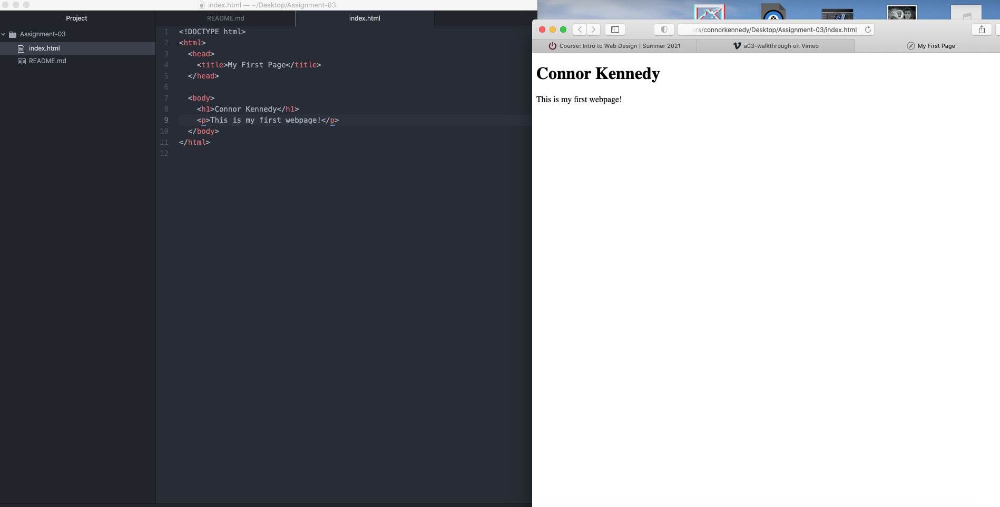

# Assignment-03
## Connor Kennedy

1. A browser takes you anywhere on the internet and displays information from other parts of the web and displays it on your device.  I mainly use safari.

2. A markup language is a computer language that uses tags to define elements within a document. A common Markup language is HTML which is the building blocks of any HTML page.

3. 
