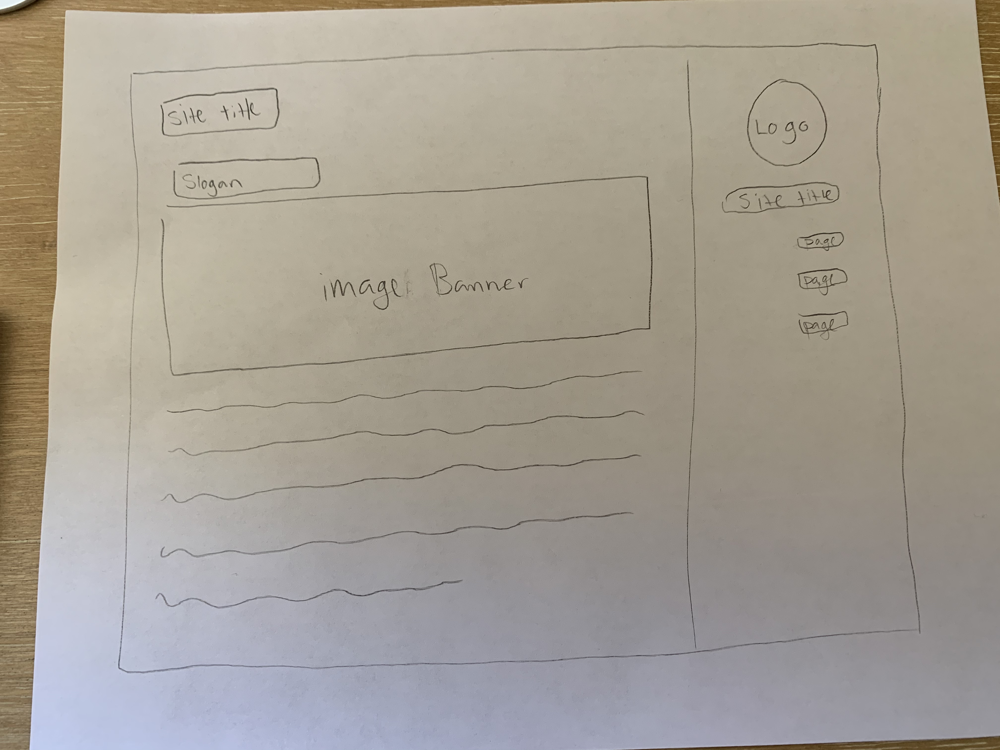

# Assignment 11
## Connor Kennedy

1.  Padding makes sure objects don't get too close to one another, Margin is where an object lies in its box and borders are the areas around boxes or objects.
2.  

3.  I worked through the tutorial and tried to change a couple things to make it a bit different. I didnt go through the social media part because I was starting to get a bit confused with the basics so I wanted to keep working with style.
